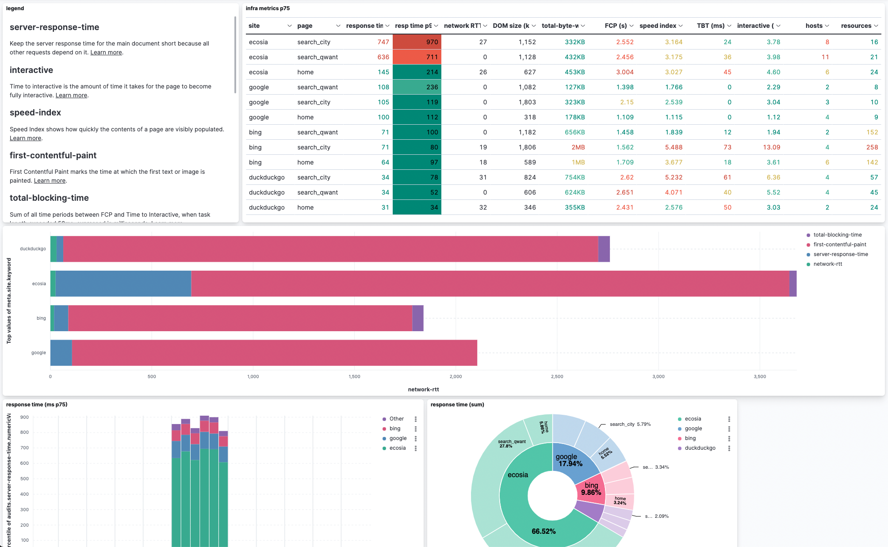

Run HTTP & lighthouse benchmarks on URLs anywhere, then store audits on elasticsearch, end analyze results on kibana.

## The idea

This project allow you to analyze quality of URLs & web pages.

There are 3 analyzers:
- nettime : get time duration of various stages of a HTTP/S request, like DNS lookup, TLS handshake, Time to First Byte etc..
- lighthouse : run on a chrome-less browser, analyze web vitals metrics
- SSL : https://github.com/drwetter/testssl.sh (@todo)

Analyze is run against several URLs (on different web sites).
All data is stored in elasticsearch, then can be data-viz'ed with kibana.

### use-case

* benchmark your web site against competitors, run during 1 hour to have multiple samples
* run during 1 day to see any anomaly (regression, down time...) on your web site
* run all the time to see any anomaly on your web site



## tech stack

* elasticsearch : storage
* kibana        : data-viz
* nodejs        : runtime
* nettime       : nodejs library
* lighthouse    : bench framework
* docker-compose: infra

https://github.com/GoogleChrome/lighthouse/blob/HEAD/docs/readme.md#using-programmatically

## Usage

### requirements

* nodeJS (tested on v17.2.0)
* Google Chrome
* elasticsearch 7.X (remote or run via Docker)

### getting started

0) Clone project

```
git clone https://github.com/ebuildy/lighthouse-urls-bench.git
cd lighthouse-urls-bench
```

1) Configure

```
cp config_example.yaml config.yaml
nano config.yaml
```

2) Run ES/kibana

If needed, there is a local docker-compose , or you can use any URL

```
docker-compose up -d
```

open http://localhost:5601/ 

3) Run bench script

(this will run in the infinite loop)

```
npm install
node src/index.mjs
```

### <!> bugs <!>

* some web sites need cookies to work: you can disable ``headless`` mode to see what happen under the hood, open a new tab on chrome in order to interact with cookie wall.
